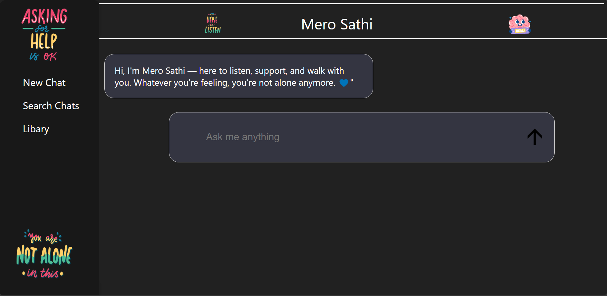

# Mero Sathi AI

Mero Sathi AI is a **Flask-based AI chatbot web application**.
Chat with AI models in real-time using a simple, responsive interface.

---

## Features

* 🤖 AI-powered chatbot interface
* 💻 Simple and responsive UI
* ⚡ Works locally with Python and Flask
* 🗂 Supports multiple AI models (`.gguf`)

---

## Installation & Setup

### 1. Clone the repository

```bash
git clone https://github.com/coder-040/Mero-Sathi-ai.git
cd Mero-Sathi-ai
```

### 2. Create a virtual environment (recommended)

```bash
python -m venv .env
```

### 3. Activate the virtual environment

**Windows:**

```bash
.env\Scripts\activate
```

**Mac/Linux:**

```bash
source .env/bin/activate
```

### 4. Install dependencies

```bash
pip install -r requirements.txt
```

### 5. Run the Flask app

```bash
python app.py
```

### 6. Open in your browser

```
http://127.0.0.1:5000
```

---

## Notes

* Large AI model files (`.gguf`) are stored in the `.models` folder.
* GitHub has a **50 MB file limit**; for very large models, consider using **Git LFS**: [https://git-lfs.github.com](https://git-lfs.github.com)
* Make sure your `.env` virtual environment is **not committed** (add to `.gitignore`).

---

## Screenshot



---

## License & Usage

© 2025 Shohan Subedi. All rights reserved.
Use of this project for **commercial purposes is prohibited**.
For permission or inquiries, contact: **[shohan.subedi@gmail.com](mailto:shohan.subedi@gmail.com)**.
